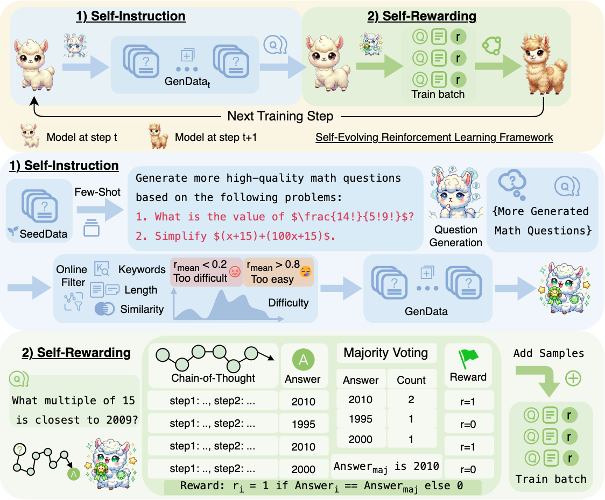
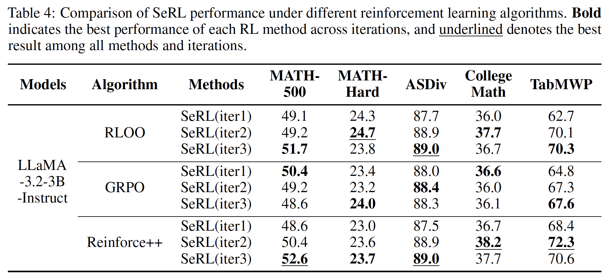
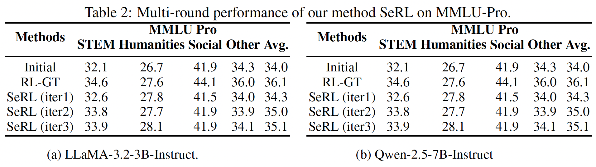

<div align="center">
<!--  -->
</div>
<h1 align="center"> SeRL: Self-Play Reinforcement Learning for Large Language Models with Limited Data</h1>


Official codebase for the paper  
📄 **"SeRL: Self-Play Reinforcement Learning for Large Language Models with Limited Data"**. This training code is based on the [OpenRLHF](https://github.com/OpenRLHF/OpenRLHF) framework, and the evaluation code is based on the [Qwen2.5-Math](https://github.com/QwenLM/Qwen2.5-Math), [Math-Verify](https://github.com/huggingface/Math-Verify) and [MMLU-Pro](https://github.com/TIGER-AI-Lab/MMLU-Pro).

<div align="center">

</div>

## Overview

**Abstract:** Recent advances have demonstrated the effectiveness of Reinforcement Learning (RL) in improving the reasoning capabilities of Large Language Models (LLMs). However, existing works inevitably rely on high-quality instructions and verifiable rewards for effective training, both of which are often difficult to obtain in specialized domains. In this paper, we propose ***Se**lf-play **R**einforcement **L**earning* (SeRL) to *bootstrap* LLM training with limited initial data. Specifically, SeRL comprises two complementary modules: self-instruction and self-rewarding. 

- The former module generates additional instructions based on the available data at each training step, employing comprehensive online filtering strategies to ensure instruction quality, diversity, and difficulty. 

- The latter module introduces a simple yet effective majority-voting mechanism to estimate response rewards for additional instructions, eliminating the need for external annotations. 

- Finally, SeRL performs conventional RL based on the generated data, facilitating iterative self-play learning.

Extensive experiments on various reasoning benchmarks and across different LLM backbones demonstrate that the proposed SeRL yields results superior to its counterparts and achieves performance on par with those obtained by high-quality data with verifiable rewards.

## 🧭 Contents

- 🗂️ [Directory Overview](#directory-overview)
- ⚙️ [Installation](#installation)
- 🧩 [SeRL Configurations](#serl-configurations)
  - 🧠 [Algorithm Choices](#algorithm-choices)
  - 🧮 [Resource Allocation](#resource-allocation)
  - 📂 [Directory Settings](#directory-settings)
  - 🎚️ [Hyperparameter Settings](#hyperparameter-settings)
  - 📈 [Logging](#logging)
- 🛠️ [Other Configurations](#other-configurations)
- 🏋️ [Training](#training)
- 🔬 [Evaluation](#evaluation)
  - ➗ [Math Benchmarks](#math-benchmarks)
  - 🧪 [MMLU-Pro Benchmark](#mmlu-pro-benchmark)
- 🚀 [Performance](#performance)
- ❓ [FAQs](#faqs)

## 🗂️ Directory Overview

* **`openrlhf/`**

  Contains training scripts and implementations.

* **`evaluation/`**

  Includes evaluation code for Math benchmarks and MMLU-Pro.


## ⚙️ Installation

We recommend using **Python 3.11**. The environment has been tested on **Ubuntu 20.04**.

```bash
# ⚠️ Installation order is critical.
# First
pip install -r requirements.txt

# Second
cd openrlhf
pip install -e .
```

## 🧩 SeRL Configurations

### 🧠 Algorithm Choices

Different training algorithms use different script templates. Choose one according to your preference. We recommend **Reinforce++** for its robustness.

* Reinforce++: `openrlhf/scripts/train/train_llama32_3b_reinforce_pp_serl_template.sh`
* GRPO: `openrlhf/scripts/train/train_llama32_3b_grpo_serl_template.sh`
* RLOO: `openrlhf/scripts/train/train_llama32_3b_rloo_serl_template.sh`

### 🧮 Resource Allocation

#### For LLaMA-3.2-3B-Instruct on 8× A6000 (48GB) GPUs:

```bash
--ref_num_nodes 1 \
--ref_num_gpus_per_node 8 \
--reward_num_nodes 1 \
--reward_num_gpus_per_node 8 \
--actor_num_nodes 1 \
--actor_num_gpus_per_node 8 \
--vllm_num_engines 8 \
--vllm_tensor_parallel_size 1 \
--vllm_gpu_memory_utilization 0.6 \
--colocate_all_models
```

#### For Qwen-2.5-7B-Instruct on 8× A6000 (48GB) GPUs:

```bash
--ref_num_nodes 1 \
--ref_num_gpus_per_node 1 \
--reward_num_nodes 1 \
--reward_num_gpus_per_node 1 \
--actor_num_nodes 1 \
--actor_num_gpus_per_node 4 \
--vllm_num_engines 2 \
--vllm_tensor_parallel_size 1 \
--vllm_gpu_memory_utilization 0.6
```

Adjust based on your available resources. For more details, see the [OpenRLHF Documentation](https://openrlhf.readthedocs.io/en/latest/quick_start.html).

### 📂 Directory Settings

| Argument                               | Description                                                                                                                                                                                                                        |
| -------------------------------------- | ---------------------------------------------------------------------------------------------------------------------------------------------------------------------------------------------------------------------------------- |
| `--runtime-env-json`                   | Set `working_dir` to `/path/to/your/SeRL/openrlhf`.                                                                                                                                                                                |
| `--pretrain`                           | Absolute path to the pretrained model.                                                                                                                                                                                             |
| `--remote_rm_url`                      | Comma-separated paths to two reward function scripts: <br>1. Majority voting reward: `/path/to/your/SeRL/reward_utils/math_verify_maj_reward.py` <br>2. Rule-based reward: `/path/to/your/SeRL/reward_utils/math_verify_reward.py` |
| `--save_path`                          | Directory to save the final trained model.                                                                                                                                                                                         |
| `--ckpt_path`                          | Directory to save intermediate checkpoints (can be same as `save_path`).                                                                                                                                                           |
| `--eval_output_root_dir`        | Set to `/path/to/your/SeRL/openrlhf/train_eval_outputs_dir` |
| `--prompt_data`                        | If `--enable_self_evolution` is set, specify the seed data directory, e.g., `/path/to/your/SeRL/dataset/math/0_2_0_8_train_with_idx_sample_500`. If `--enable_self_evolution` is not set, specify the directory for the prompt data used during training.                                                                                     |
| `--train_samples_root_dir`             | Deprecated. Set to `/path/to/your/SeRL/openrlhf/train_eval_outputs_dir`.                                                                                                                                                           |
| `--filtered_data_root_dir`             | Directory for storing data that has been filtered out during training due to difficulty filtering, expiration after a certain number of steps, or data that was ultimately used for training. Typically set to `/path/to/your/SeRL/openrlhf/train_online_filtered_data_dir`. If `--enable_self_evolution` is enabled, this will be overridden by `--evolution_generation_data_root_dir` as the output directory.                                                                                                  |
| `--evolution_generation_data_root_dir` | Output directory when using self-evolution. Set to `/path/to/your/SeRL/openrlhf/evolution_generation_data_dir`.                                                                                                                    |
| `--eval_dataset`                       | Path to evaluation dataset, e.g., `/path/to/your/SeRL/evaluation/Math-Benchmarks/data/math_500/test_with_idx.jsonl`.                                                                                                                              |
| `--few_shot_generation_prompt`         | Prompt file for few-shot instruction generation. Set to `/path/to/your/SeRL/openrlhf/prompts/instruction_generation.jsonl`.                                                                                                        |

### 🎚️ Hyperparameter Settings

Recommended settings for **Reinforce++**:

```bash
--micro_train_batch_size 2 \
--train_batch_size 16 \
--micro_rollout_batch_size 4 \
--rollout_batch_size 16 \
--n_samples_per_prompt 16 \
--max_epochs 1 \
--prompt_max_len 1024 \
--generate_max_len 1024 \
--actor_learning_rate 5e-7 \
--init_kl_coef 1e-4 \
--reward_difficulty_bounds 0.2 0.8 \
--instructions_num_per_iteration 2000
```

Adjust `micro_*_batch_size` to avoid OOM based on your hardware.

### 📈 Logging

* `--use_wandb`: Set to your personal Weights & Biases API key.
* `--wandb_run_name`: Custom name for the current run.

## 🛠️ Other Configurations

### Training with Rule-Based Reward

**Reference Script**:  
`openrlhf/scripts/train/train_llama32_3b_reinforce_pp_gt_template.sh`

- `--remote_rm_url`: Set to a custom rule-based reward function, e.g., `/path/to/your/SeRL/openrlhf/reward_utils/math_verify_maj_reward.py`.
- `--prompt_data`: Use training data **with ground truth labels**.
- `--num_episodes`: Set to `1`.

These parameters are not needed any more:
- `--reward_difficulty_bounds`
- `--enable_self_evolution`
- `--few_shot_generation`
- `--evolution_generation_data_root_dir`
- `--few_shot_generation_prompt`
- `--few_shot_generation_batch_size`
- `--instructions_num_per_iteration`

### Training with Majority-Vote-Based Reward (Without Online Self-Instruction)

**Reference Script**:  
`openrlhf/scripts/train/train_llama32_3b_reinforce_pp_maj_template.sh`

- `--prompt_data`: Use your instructions data; ground truth labels are **not** required.
- `--num_episodes`: Set to `1`.
- `--reward_difficulty_bounds`: **Recommended to enable** to mitigate reward hacking.

These parameters are not needed any more:
- `--enable_self_evolution`
- `--few_shot_generation`
- `--evolution_generation_data_root_dir`
- `--few_shot_generation_prompt`
- `--few_shot_generation_batch_size`
- `--instructions_num_per_iteration`

## 🏋️ Training

Before training, update the training script using the configurations above.

```bash
ray start --head --node-ip-address 0.0.0.0
cd openrlhf
zsh scripts/train/<your_train_script>
```

## 🔬 Evaluation

### ➗ Math Benchmarks

Supported datasets:
`asdiv, carp_en, college_math, gaokao2023en, mawps, minerva_math, mmlu_stem, olympiadbench, svamp, tabmwp`

#### Pass\@1 Evaluation

1. Modify `evaluation/Math-Benchmarks/scripts/vllm_gen_outputs_greedy_template.sh`:

   * `CUDA_VISIBLE_DEVICES`: set GPU IDs.
   * `DATA_NAME`: comma-separated dataset names.
   * `MODEL_PATH_LIST`: paths to models.
   * `DATA_DIR`: path to `/path/to/your/evaluation/Math-Benchmarks/data`.

   Output is saved in `evaluation/Math-Benchmarks/outputs`.

2. Modify `evaluation/Math-Benchmarks/scripts/evaluate_outputs_template.sh`:

   * `OUTPUT_DIRS`: set to output directory paths (ending in `math_eval_sampling_n` directory).
   * `SUBDIRS`: dataset names to evaluate.
   * `FILE_NAME`: Set as the filename to be evaluated.

   Results will be saved in the same directory.

#### Maj\@K Evaluation

1. Modify `evaluation/Math-Benchmarks/scripts/vllm_gen_outputs_n_sampling_template.sh`:

   * Set `N_SAMPLING` to **K** (e.g., 16 or 32).
   * `CUDA_VISIBLE_DEVICES`: set GPU IDs.
   * `DATA_NAME`: comma-separated dataset names.
   * `MODEL_PATH_LIST`: paths to models.
   * `DATA_DIR`: path to `/path/to/your/evaluation/Math-Benchmarks/data`.

2. Modify `evaluation/Math-Benchmarks/scripts/find_outputs_maj_template.sh`:

   * `OUTPUT_DIRS`: set to output directory paths (ending in `math_eval_sampling_n` directory).
   * `SUBDIRS`: dataset names to evaluate.
   * `FILE_NAME`: Set as the filename to be evaluated.

3. Modify `evaluation/Math-Benchmarks/scripts/evaluate_outputs_maj_template.sh`:

   * `OUTPUT_DIRS`: set to output directory paths (ending in `math_eval_sampling_n` directory).
   * `SUBDIRS`: dataset names to evaluate.
   * `FILE_NAME`: Set as the filename to be evaluated. This should be the file generated in the previous step with the maj_eval suffix.
   * `MAJ_K`: Evaluates Maj@K performance


Results are saved in the output directory.

### 🧪 MMLU-Pro Benchmark

1. Modify `evaluation/MMLU-Pro/scripts/eval_models_template.sh`:

   * `CUDA_VISIBLE_DEVICES`: your available GPUs.
   * `models`: paths to the models.

Results are saved in `evaluation/MMLU-Pro/eval_results/summary`.

To categorize and compute statistics across subject areas (`STEM`, `Humanities`, `Social`, `Other`), use the function `mmlu_pro_acc` in
`evaluation/data_utils/data_utils.py`.

Set the `input_file` to the result summary and run the script to output categorized results.


## 🚀 Performance

Performance of LLaMA-3.2-3B-Instruct using different algorithms under our SeRL framework on Math Benchmarks



Evaluation of LLaMA-3.2-3B-Instruct and Qwen-2.5-7B-Instruct with the Reinforce++ algorithm under our SeRL framework on MMLU-Pro



## ❓ Frequently Asked Questions (FAQs)

### 1. Why do I see errors during training or evaluation?

Some errors you encounter during training or evaluation are **internally caught and handled** by the Math-Verify evaluation process.  
These internal exceptions **do not affect** the correctness or reliability of the overall training or evaluation results.  
You can generally ignore them unless explicitly reported as critical.

---

### 2. What should I do if training gets stuck?

Occasionally, training might freeze or get stuck due to hardware or framework instability.  
If this happens, simply **resume training from the latest checkpoint** (`ckpt`).  
✅ This is supported by OpenRLHF.

---

### 3. FlashAttention 2 error: `undefined symbol`

You may encounter an error like this:
```
lib/python3.11/site-packages/flash_attn_2_cuda.cpython-311-x86_64-linux-gnu.so:
undefined symbol: _ZN3c105ErrorC2ENS_14SourceLocationENSt7__cxx1112basic_stringIcSt11char_traitsIcESaIcEEE
```

This usually means there's a **version mismatch** between your Python, PyTorch, and CUDA versions and those expected by FlashAttention 2.

#### ✅ Solution

1. Visit the [FlashAttention release page](https://github.com/Dao-AILab/flash-attention/releases).
2. Find the correct `.whl` file that matches your:
   - Python version (e.g., 3.11)
   - PyTorch version
   - CUDA version
3. Download the package using `wget`:
   ```bash
   wget <URL_TO_WHL>
   ```
4. Install it using pip:

   ```bash
   pip install <PACKAGE_NAME>.whl
   ```


## ⚖️ License

| Component        | License                                                                                                                             |
|------------------|-------------------------------------------------------------------------------------------------------------------------------------|
| [Codebase](https://github.com/wantbook-book/SeRL)     | [Apache-2.0 License](https://github.com/wantbook-book/SeRL/blob/main/LICENSE)                                                                                                  |

## 🙏 Acknowledgments

- [OpenRLHF](https://github.com/OpenRLHF/OpenRLHF) for the RL training framework  
- [Math-Verify](https://github.com/huggingface/Math-Verify), [Qwen2.5-Math](https://github.com/QwenLM/Qwen2.5-Math), and [MMLU-Pro](https://github.com/TIGER-AI-Lab/MMLU-Pro) for evaluation support.