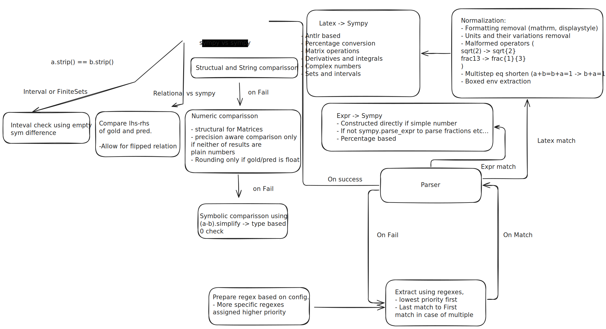

# Math-Verify
A robust mathematical expression evaluation system designed for assessing Large Language Model outputs in mathematical tasks. This evaluator achieves the highest accuracy and most correct scores compared to existing evaluators on MATH dataset:
| Evaluator     | Score   |
|---------------|---------|
| Harness       | 0.0802  |
| Qwen          | 0.1288  |
| Math-Verify   | 0.1328  |

## Installation
Math-Verify currently supports multiple antlr4 runtimes:
- `antlr4-python3-runtime==4.13.2`
- `antlr4-python3-runtime==4.11.0`
- `antlr4-python3-runtime==4.9.3`

To install Math-Verify with a specific antlr4 runtime, use the following command:
```bash
pip install math-verify[antlr4_13_2]
```

We recommend always specifying the antlr4 runtime to avoid any potential issues.

## Example Usage
```python
from math_verify import parse, verify

# Parse the gold and answer
# If you know that gold will only contain latex or expr (no latex env), use
# parse(gold, extraction_config=[LatexExtractionConfig()]) or parse(gold, extraction_config=[ExprExtractionConfig()])

gold = parse("${1,3} \\cup {2,4}$")
answer = parse("${1,2,3,4}$")

# Order here is important!
verify(gold, answer)
# >>> True
```

## Extraction Targets
The parser supports three main extraction targets:

1. **LatexExtractionConfig** - Extracts LaTeX expressions with configurable options (see docstring) (e.g. '\[ \sqrt{2} \]'). Do note that the latex must be placed in latex environment to be parsable.
2. **ExprExtractionConfig** - Extracts plain mathematical expressions (e.g. '1/2')
3. **StringExtractionConfig** - Extracts literal strings (e.g. 'A')

By default, the parser uses both LatexExtractionConfig and ExprExtractionConfig for maximum flexibility in extracting mathematical expressions from model outputs.

## Why Another Math Evaluator?

Existing math evaluators often fail to correctly assess model outputs due to:
1. Strict format requirements (expecting exact patterns like "Final answer is X")
2. Limited parsing capabilities (especially for complex mathematical notations)
3. Inflexible comparison logic (unable to recognize equivalent expressions)
As result, this can lead to significant underestimation of model performance, in extreme cases, even by 40 points.

## Key Features

### 1. Robust Answer Extraction
- Multiple extraction strategies (LaTeX, Plain Numerical Expressions)
- Answer retrieval is done in format agnostic manner, with best effort to extract the answer.
- Supports all standard latex formats for the best retrieval.

### 2. Advanced Parsing Capabilities
- Complete set theory support (Intervals, FiniteSets, set operations)
- Unicode symbol substituion support (e.g. `β -> beta`)
- Applies Latex fixes for common malformations (e.g. `frac13 -> 1/3`)
- Equation and inequality parsing, with symbol assignment resolution (e.g. `x = 1 -> 1`)
- Percentage best effort conversion (e.g. `10% -> 0.1`)
- Units in text handling (e.g. `10 cm -> 10`)
- Exact representation of the input expressions (e.g. `0.333 -> Float(333, 3)`)

### 3. Intelligent Expression Comparison
- Both numerical and symbolic comparison support
- Precise numerical comparison for numerical types with configurable rounding tolerance
- Matrix expression equivalence validation
- Set and interval comparison
- Relation evaluation with flip support (e.g., `a < 2 == 2 > a`)

## Advanced Usage
If you already have a model outputs, format them into a csv file with `answer`, `gold` columns.
Then run the following command:
```bash
python evaluate_model_outputs.py --input_csv <path_to_csv> (examples/model_outputs.csv) --output_csv <path_to_csv> (output.csv)
```

If you want to evaluate a model from ground up, we have provided a script for end to end evaluation with support for following datasets:
- MATH-Hard
- MATH-500
- GSM8K
- AMC23
- AIME24

This script requires the optional "inference" dependencies to be installed, e.g. as follows:
```bash
pip install 'math-verify[inference]'
```

Run the following command to evaluate a model:
```bash
python evaluate_model.py --model <model_name> (HuggingFaceTB/SmolLM2-135M) --use_chat_template (True) --task <task_name> (amc23)
```

Lastly if you want to only extract the answers from model outputs, you can run the following command:
```bash
python extract_answers.py --input_csv <path_to_csv> (examples/sample_answers.csv) --output_csv <path_to_csv> (output.csv)
```

## Architecture




The grading process follows a three-step algorithm:
Answer Extraction -> Expression Common Representation Conversion (SymPy) -> Gold Comparison

1. **Answer Extraction** (see `math_verify/parser.py`): 
   Retrieves the answer from the model output in a format-agnostic manner.
   1. Regex patterns are prepared based on configuration, each with a priority indicating the order of application.
   2. Priorities range from the most concrete answer format to the most abstract.
   3. Regex patterns are applied in order of priority; if multiple matches occur, those appearing last are chosen first.
   4. The first regex match that successfully converts to a common representation (SymPy) is returned; additionally, returning the first match is also allowed.

2. **Answer Parsing** (see `latex2sympy2_extended/latex2sympy2.py`):
   - Converts the extracted answer to a common representation (SymPy).
   1. Normalizes the extracted answer to address the following issues:
      - Basic LaTeX commands (e.g., \mathrm, \displaystyle)
      - Units and their variations
      - Malformed operators (e.g., \sqrt, \frac)
      - Minor formatting fixes (spaces, dots, etc.)
      - Boxed environments
      - Equation splitting and approximations
   2. Parses the normalized answer using ANTLR4 grammar to convert it to a SymPy expression.
   3. Handles special cases:
      - Percentage conversion
      - Matrix operations 
      - Derivatives and integrals
      - Complex numbers
      - Sets and intervals

3. **Gold Comparison** (see `math_verify/grader.py`):
   - Compares the parsed answer with the gold answer.
   1. Initially attempts string comparison and basic SymPy equality:
      - Direct string comparison after normalization
      - Basic SymPy structural equality (e.g., a + b vs b + a)
   
   2. For numeric expressions:
      - Numeric equality within specified precision (e.g., 0.333333 ≈ 1/3)
      - Symbolic equality by simplifying the difference (a - b = 0)
   
   3. Special handling for different types:
      - Relational expressions (equations/inequalities):
        * Compares normalized forms
        * Handles flipped inequalities (e.g., a ≤ b equals b ≥ a)
      
      - Sets and intervals:
        * Direct set equality and symmetric difference
        * Element-wise comparison for finite sets
        * Special handling for interval vs. finite set cases
        * Interval endpoint comparison with precision
      
      - Matrices and vectors:
        * Element-wise comparison
        * Shape validation
        * Special handling for matrix operations
   
   4. Complex number support:
      - Detection of complex expressions
      - Handling of different complex notations (e.g., i, ℂ)
      - Matrix operations (e.g., det, trace, rank)
      - Complex functions (e.g., Re, Im, arg)
   
   5. Robust error handling:
      - Timeout protection for long computations
      - Graceful fallback for failed comparisons
      - Multiple comparison attempts with different methods


## FAQ

### Why is verify function not symmetric?

The verify funciton, doesn't have symmetric behavior in two cases:

**1. Representation Asymmetry (Interval vs. Inequality):**
- If the gold answer is an inequality (e.g., `1 < x < 2`) and the prediction is an interval (e.g., `(1,2)`), the verification will return `True`.
- However, if the gold answer is an interval (e.g., `(1,2)`) and the prediction is the inequality (e.g., `1 < x < 2`), it will return `False`.
- This asymmetry is designed to prevent models from simply returning the input inequality when an, which could be considered a form of "reward hacking".

**2. Solution Context Asymmetry (Number vs. Solution Chain):**
- If the gold answer is a number (e.g., `101`) and the prediction is a solution chain leading to that number (e.g., `a+2z = 2z + a = 101`), the verification will return `True`.
- Conversely, if the gold answer is a solution chain (e.g., `a+2z = 2z + a = 101`) and the prediction is just the final number (e.g., `101`), it will return `False`.
- Determining whether we are evaluating an equation or a solution chain is complex. The `verify` function uses the gold answer as a guide. It assumes gold answers are "cleaned" in a preferred format.


### What setting I should use for my dataset?
- First you should determine what your dataset gold looks like. If it's just a simple numbers, use `ExprExtractionConfig()`. If it's latex, use `LatexExtractionConfig()`. If the gold answer contain floats, make sure to set correct float precision. Lastly if it's just MCQ strings (A,B,C,D), use `StringExtractionConfig()`.

- For prediction, we recommend using `LatexExtractionConfig()` and `ExprExtractionConfig()` together unless you have control over the model output. Additionally, we recommended instructing the model to output the answer in a `\boxed{}` environment and set `boxed_match_priority` to 0 in the latex extraction config.

- For reward verification, we recommend further using the following normalization configuration of latex extraction config for prediction:
  - `basic_latex=True`
  - `units=True`
  - `malformed_operators=False`
  - `nits=False`
  - `boxed="all"`
  - `equations=False`
As we are rewarding a model, we want to enforce that it produces a fully valid LaTeX answer.

- We don't recommend mixing `StringExtractionConfig()` with other configs, as it might produce unexpected results. Especially when you are searching for A/B/C/D type of answer, because we are taking the first match, it will often find separate A, B, C, or D characters in the text, which is probably not desired.

### Why is the latex extraction not working?
- It's important that all latex epxressions are placed in latex environment. For example, `\[ x = 1 \]` is valid, but `x = 1` will not extract anything. Following environments are supported:
  - Multi-line latex expressions
  - `\[ ... \]`
  - `$$ ... $$`
  - `\boxed{...}`
  - Single line latex expressions
  - `$...$`
  - `\( ... \)`
  - `[ ... ]`
